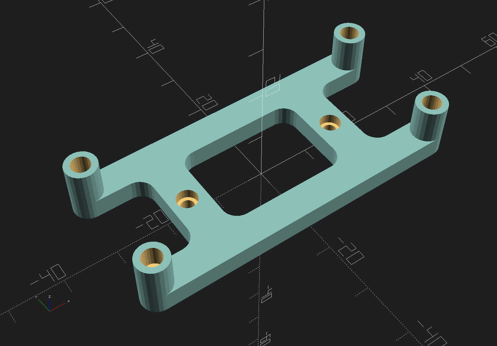

# Zero4U DIN rail mount

A printable DIN rail mount for the [Zero4U USB hat](https://www.adafruit.com/product/3298) for the Raspberry Pi Zero.

## Hardware required

For the Voron DIN clip version:

* 1 [Voron DIN rail clip](https://github.com/VoronDesign/Voron-2/blob/Voron2.4/STLs/Electronics_Bay/pcb_din_clip_x3.stl)
* 2 M2.5x6 self-tapping screws
* 4 M2.5 threaded inserts

For the low profile clip version:

* 1 [Low profile DIN rail clip](https://www.printables.com/model/1089827-low-profile-din-rail-clip)
* 2 M3x5 FHCS
* 4 M2.5 threaded inserts

For the "even lower" profile clip version:

* 2 M2.5x6 self-tapping screws
* 4 M2.5 threaded inserts

## Printing

Use standard Voron print settings for walls and infill for ABS.

## Assembly

1. Print the mount and any necessary clips. For the "event lower" version, print two.
2. Install the four heat-set threaded inserts into the column holes.
3. Attach the rail clip to the mount using self-tapping screws (Voron clip version) or M3x5 FHCS (low profile version). 
4. Use the nylon screws and spacers provided with the Zero4U to install the hub and Pi Zero onto the mount.

