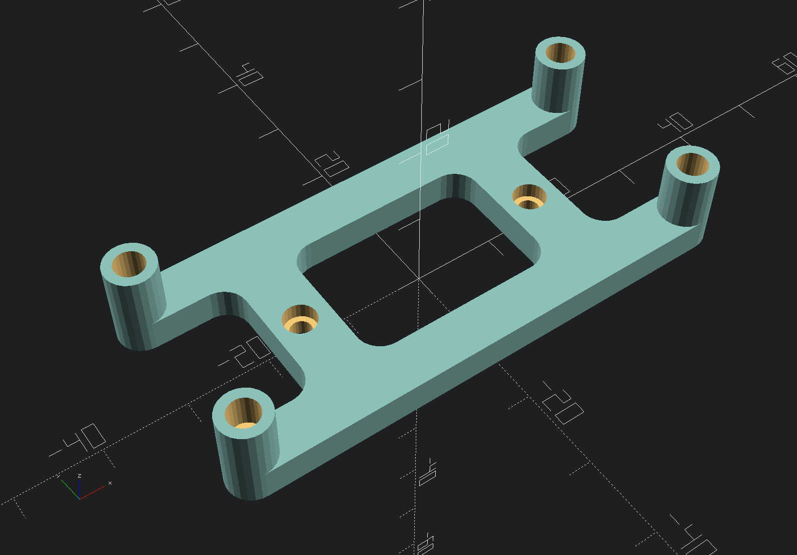

# Zero4U DIN rail mount

A printable DIN rail mount for the [Zero4U USB hat](https://www.adafruit.com/product/3298) for the Raspberry Pi Zero.

## Hardware required

* 1 [Voron DIN rail clip](https://github.com/VoronDesign/Voron-2/blob/Voron2.4/STLs/Electronics_Bay/pcb_din_clip_x3.stl)
* 2 M2.5x6 self-tapping screws
* 4 M2.5 threaded inserts

## Printing

Use standard Voron print settings for walls and infill for ABS.

## Assembly

1. Print the DIN rail clip.
2. Install the four heat-set threaded inserts into the column holes.
3. Use the self-tapping screws to affix the mount to the clip. 
4. Use the provided nylon screws and spacers to install the hub and Pi Zero onto the mount.

